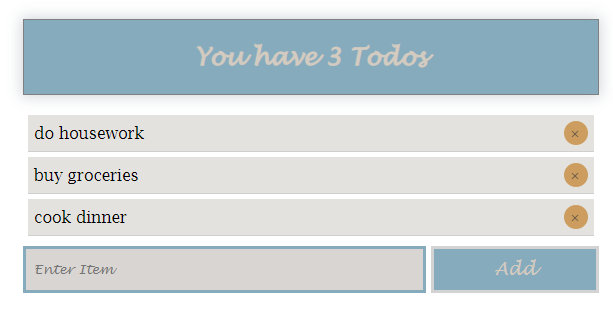

# Alena Deviatova

### Contact information

**Phone:** +79852159605

**E-mail:** aedeviatova@yandex.ru

**Telegram:** @aedeviatova

**GitHub:** [deviatovae](https://github.com/deviatovae)
___

### Skills

- HTML
- CSS
- Javascript
- Git
___

### Courses

- FreeCodeCamp
- HTML Academy
- W3Schools
- RS-school / JavaScript/Front-end (in progress)
___

### About me

My learning path in programming started a year ago when I decided to quit my job as an English teacher and challenge myself to learn coding.

I am fully aware of the step I make to embrace the complexity of coding, yet I believe it will be a fun and rewarding journey. 
___

### Code examples


Consider an array/list of sheep where some sheep may be missing from their place. 

We need a function that counts the number of sheep present in the array (true means present).

[Codewars](https://www.codewars.com/)

```js
function countSheeps(arrayOfSheep) {
    
   return arrayOfSheep.reduce ((total, sheep) => total + (sheep ? 1 : 0))
}
```
___

### Projects on GitHub


https://deviatovae.github.io/image-carousel/


https://deviatovae.github.io/todo-practice/
___

### Languages

- Russian / *Native* 
- English / *Proficient*
- French / *Advanced*